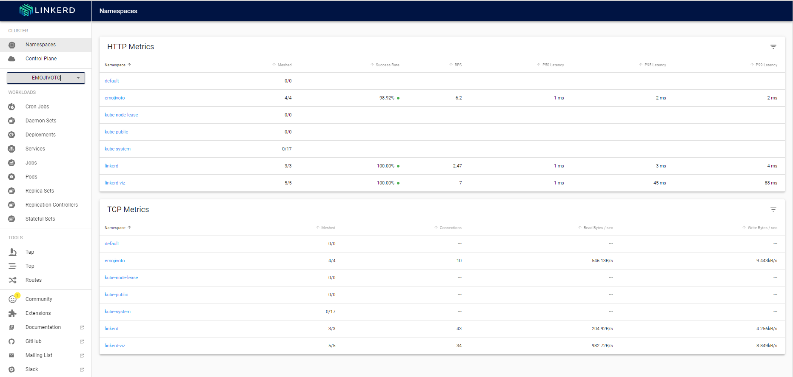
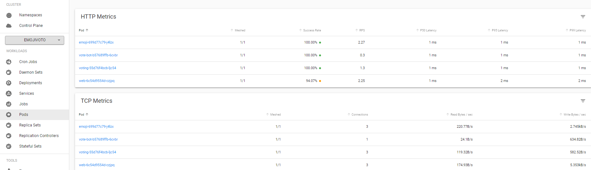

# Introduction to Linkerd Service Meshes:
[](doc-images/linkerd.jpg)

## What is Sevice Mesh ?

A service mesh is a tool for adding observability, security, and reliability features to “cloud native” applications by transparently inserting this functionality at the platform layer rather than the application layer.
The service mesh is typically implemented as a scalable set of network proxies deployed alongside application code (a pattern sometimes called a sidecar). These proxies handle the communication between the microservices and also act as a point at which the service mesh features can be introduced.Service mesh allows you to separate the business logic of the application from observability, and network and security policies. It allows you to connect, secure, and monitor your microservices.
The service mesh is rapidly becoming a standard part of the cloud native stack, especially for Kubernetes adopters.
Linkerd is a service mesh for Kubernetes.Linkerd.Linkerd is a Cloud Native Computing Foundation-graduated project that is totally open source and licensed under Apache v2.

This manual will show you step-by-step how to deploy Linkerd in your Kubernetes cluster. Next, we'll launch a demonstration application.

## Why Use a Service Mesh?
If you are building applications on Kubernetes, then a service mesh like Linkerd provides critical observability, reliability, and security features.
Linkerd offer this features with on big advantages : the application doesn’t need to implement these features, or even to be aware that the service mesh is there!

- ***Service mesh security*** :
By default, all pods and services send fully unencrypted packets between other pods and services , A service mesh solves this with mTLS.
Linkerd automatically enables mutually-authenticated Transport Layer Security (mTLS) for all TCP traffic between meshed pods. This means that Linkerd adds authenticated, encrypted communication to your application with no extra work on your part.With a service mesh, you're protected inside the pod network !

- ***Service mesh observability*** :
As services grow in complexity, it becomes challenging to understand behavior and performance.You need easily-visible metrics to confirm that your containerized application is performing as expected
One of Linkerd’s most powerful features is its extensive set of tooling around observability—the measuring and reporting of observed behavior in meshed applications.
Linkerd’s telemetry and monitoring features function automatically, without requiring any work on the part of the developer. These features include:
* Recording of top-line (“golden”) metrics (request volume, success rate, and latency distributions) for HTTP, HTTP/2, and gRPC traffic
* Recording of TCP-level metrics (bytes in/out, etc) for other TCP traffic
* Reporting metrics per service, per caller/callee pair, or per route/path
* Generating topology graphs that display the runtime relationship between services.

> The viz extension installs the following components into your linkerd-viz namespace:
* A Prometheus instance
* metrics-api, tap, tap-injector, and web components

These components work together to provide an on-cluster metrics stack.

- ***Service mesh reliability***
When a pod is deployed, the application running in it may or may not be working as expected ,if the application isn't running as expected, users cannot access it, engineers must drop what they're doing and troubleshoot the application.The service mesh load balancer helps to route traffic to healthy instances
Linkerd uses an algorithm called EWMA, or exponentially weighted moving average, to automatically send requests to the fastest endpoints. This load balancing can improve end-to-end latencies.

[](doc-images/very-nice-meme.png)
## Linkerd components
At a high level, Linkerd consists of a control plane and a data plane.

[](doc-images/Linkerd-Archi.PNG)

1- ***the Control plane***: providing the services for automatically injecting data plane components into pods(poxy-injector), generate certificates used in mTLS communications in the data plane and authorized data plane componentes (identity), and traffic flow control services (destination)
- The destination service is used by the data plane proxies to determine various aspects of their behavior
- The identity service acts as a TLS Certificate Authority that accepts CSRs from proxies and returns signed certificates. These certificates are issued at proxy initialization time and are used for proxy-to-proxy connections to implement mTLS.
- The proxy injector is a Kubernetes admission controller that receives a webhook request every time a pod is created

2- ***The Data Plane***, transparent proxy running as sidecar container within the pods. Proxies automatically intercept Pod’s inbound/outbound TCP traffic and add transparantly encryption (mTLS), Later-7 load balancing, routing, retries, telemetry, etc.
- The Linkerd2-proxy is an ultralight, transparent micro-proxy written in Rust. Linkerd2-proxy is designed specifically for the service mesh use case and is not designed as a general-purpose proxy.
- The linkerd-init container is added to each meshed pod as a Kubernetes init container that runs before any other containers are started. It uses iptables to route all TCP traffic to and from the pod through the proxy.

> Linkerd also provides a ***CLI*** that can be used to interact with the control and data planes.

## Assumptions and prerequisites
- Basic hands-on experience with Kubernetes.
- Access to modern Kubernetes cluster
- A functioning kubectl command on your local machine

## Step by step :Install Linkerd

During this section, we’ll borrow instructions from the linkerd official documentation page.
we’ll install the Linkerd CLI and use it validate that your cluster is capable of hosting Linkerd.

1- Install the CLI
We will need to download the linkerd CLI onto your local machine. The CLI will allow you to interact with your Linkerd deployment.
```
$ curl --proto '=https' --tlsv1.2 -sSfL https://run.linkerd.io/install | sh
```
Add the linkerd CLI to your path with:
```
$ export PATH=$PATH:/root/.linkerd2/bin
```
Once installed, verify the CLI is running correctly with:
```
$ linkerd version
```
2- Validate your Kubernetes cluster
Before we can install the Linkerd control plane, we need to check and validate that everything is configured correctly
```
$ linkerd check --pre
kubernetes-api
--------------
√ can initialize the client
√ can query the Kubernetes API

kubernetes-version
------------------
√ is running the minimum Kubernetes API version

pre-kubernetes-setup
--------------------
√ control plane namespace does not already exist
√ can create non-namespaced resources
√ can create ServiceAccounts
√ can create Services
√ can create Deployments
√ can create CronJobs
√ can create ConfigMaps
√ can create Secrets
√ can read Secrets
√ can read extension-apiserver-authentication configmap
√ no clock skew detected

linkerd-version
---------------
√ can determine the latest version
√ cli is up-to-date

Status check results are √
```
3- Install Linkerd onto your cluster
 it’s time to install Linkerd on your Kubernetes cluster , here are two methods:

- The CLI
- Helm

We’ll demonstrate using Cli ,To do this, run:

```
$ linkerd install --crds | kubectl apply -f -   # install the Linkerd CRDs
$ linkerd install | kubectl apply -f -          # install the control plane into the 'linkerd' namespace
```
> The install --crds command installs Linkerd’s Custom Resource Definitions (CRDs), which must be installed first, while the install command installs the Linkerd control plane.

It may take a minute or two for the control plane to finish installing. Wait for the control plane to be ready (and verify your installation) by running:

```
$ linkerd check
kubernetes-api
--------------
√ can initialize the client
√ can query the Kubernetes API

kubernetes-version
------------------
√ is running the minimum Kubernetes API version

linkerd-existence
-----------------
√ 'linkerd-config' config map exists
.
.
.
.
Status check results are √
```
## Demo App

Congratulations, Linkerd is installed! However, it’s not doing anything just yet. To see Linkerd in action, we’re going to need an application.
We will use an application called " Emojivoto" , it uses a mix of gRPC and HTTP calls to allow the user to vote on their favorite emojis.
1- First let's connect to our Kubernetes cluster (We will use an aks cluster in thid demostration)
```
 $ az aks get-credentials --resource-group Saif-aks-lab  --name my-aks-cluster
 $ kubectl get nodes
   NAME                                STATUS   ROLES   AGE     VERSION
   aks-agentpool-63985312-vmss000000   Ready    agent   2m12s   v1.24.9
   aks-agentpool-63985312-vmss000001   Ready    agent   2m19s   v1.24.9
   aks-agentpool-63985312-vmss000002   Ready    agent   2m19s   v1.24.9
```
2- Create an namespace for the demo application :
```
$ kubectl create namespace emojivoto
```
3- Then we will deploy four applications: emoji , vote-bot ,  voting and web , then create the services to expose this applications, finally create three ServiceAccount : emoji , voting and web
- You can clone the application git repos from here  : https://github.com/linkerd/website/blob/main/run.linkerd.io/public/emojivoto.yml

[](doc-images/app-archi.PNG)

Check the differnts created resources:
```
$ kubectl get serviceaccount -n emojivoto
  NAME      SECRETS   AGE
  default   0         63s
  emoji     0         29s
  voting    0         28s
  web       0         28s
```
```
$ kubectl get  service -n emojivoto
  NAME         TYPE        CLUSTER-IP     EXTERNAL-IP   PORT(S)             AGE
  emoji-svc    ClusterIP   10.0.241.38    <none>        8080/TCP,8801/TCP   15s
  voting-svc   ClusterIP   10.0.113.204   <none>        8080/TCP,8801/TCP   15s
  web-svc      ClusterIP   10.0.95.131    <none>        80/TCP              15s
```
```
$ kubectl get po -n emojivoto
  NAME                        READY   STATUS    RESTARTS   AGE
  emoji-78594cb998-c5tgm      1/1     Running   0          21s
  vote-bot-786d75cf45-jvvlv   1/1     Running   0          21s
  voting-5f5b555dff-vrncv     1/1     Running   0          21s
  web-68cc8bc689-f457p        1/1     Running   0          20s
```
4- Forward web-svc locally to port 8080 to take a look at Emojivoto in its natural state
```
$ kubectl -n emojivoto port-forward svc/web-svc 8080:80
```

5- Once deployed, you’ll need a way to get the Linkerd sidecar into the application Namespace. The easiest way in this instance is to inject the sidecar into every containerized deployment via the inject command.
```
$ kubectl get -n emojivoto deploy -o yaml \
  | linkerd inject - \
  | kubectl apply -f -
```
 Visit again the application at http://localhost:8080 ,We’ve added Linkerd to Emojivoto, but there are no visible changes to the application! That is part of Linkerd’s design—it does its best not to interfere with a functioning application.

6- To take a closer look at what Linkerd is actually doing we need to add the linkerd viz extension :

```
$ linkerd viz install | kubectl apply -f -
```

The final step is to view the microservice that you deployed in the application installation section in the Linkerd UI , run Viz locally.
```
$ linkerd viz dashboard &
```
> The Viz dashboard will automatically open up for you. Change the Namespace to the emojivoto Namespace and you’ll now see that the containerized applications running in the emojivotoNamespace are secured with Linkerd.

[](doc-images/linkerd-UI.PNG)

Click to the pods button , You cannow see the HTTP and TCP metrics of each  pods

[](doc-images/Pod-HTTP-TCP.PNG)

## That’s it! 👏

Congratulations, you have joined the exalted ranks of Linkerd users! Give yourself a pat on the back.I appreciate you reading. 🙏
 What’s next? Here are some usufuel references :
- https://linkerd.io/
- https://www.redhat.com/en/topics/microservices/what-is-a-service-mesh
- https://training.linuxfoundation.org/training/introduction-to-service-mesh-with-linkerd-lfs143/
- https://istio.io/latest/about/service-mesh/s
